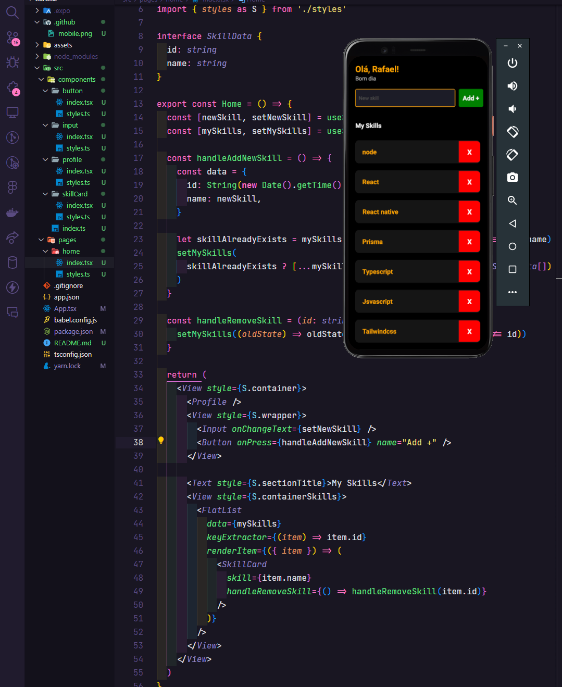

<h3 align="center">
    <b>MySkills</b>
    <br>
</h3>

# Índice

- [Sobre](#sobre)
- [Tecnologias Utilizadas](#tecnologias-utilizadas)
- [Como Usar](#como-usar)
- [Como Contribuir](#como-contribuir)

<a id="sobre"></a>

## :bookmark: Sobre

O <strong>MySkilld</strong> é uma aplicação mobile desenvolvido durante o Bootcamp do Ignite da Rocketseat, o primeiro projeto pratico onde aprendemos os fundamentos do react native.
<br/>

<a id="tecnologias-utilizadas"></a>

## :rocket: Tecnologias Utilizadas

O projeto foi desenvolvido utilizando as seguintes tecnologias

- [React Native](https://developer.mozilla.org/pt-BR/docs/Aprender/HTML/Introducao_ao_HTML)
- [JavaScript](https://developer.mozilla.org/pt-BR/docs/Web/JavaScript)
- [Typescript](https://developer.mozilla.org/pt-BR/docs/Web/JavaScript)

## :heavy_check_mark: :computer: Resultado Mobile

<h1 align="center">
    
</h1>

<a id="como-usar"></a>

## :fire: Como usar

- ### **Pré-requisitos**

  - É **necessário** possuir o **[Node.js](https://nodejs.org/en/)** instalado na máquina
  - Também, é **preciso** ter um gerenciador de pacotes seja o **[NPM](https://www.npmjs.com/)** ou **[Yarn](https://yarnpkg.com/)**.
  - Por fim, é **essencial** ter o **[Expo](https://expo.io/)**
    instalado de forma global na máquina

1. Faça um clone :

```sh
  $ git clone https://github.com/Rafael-Rufino/myskill_mobile
```

2. Executando a Aplicação:

```sh
  # Instale as dependências
  $ npm
  ou
  $yarn

  # Inicie a aplicação web
  $ cd myskill_mobile 
  $ expo start

```

<a id="como-contribuir"></a>

## :recycle: Como contribuir

- Faça um Fork desse repositório,
- Crie uma branch com a sua feature: `git checkout -b my-feature`
- Commit suas mudanças: `git commit -m 'feat: My new feature'`
- Push a sua branch: `git push origin my-feature`

## :memo: License

Esse projeto está sob a licença MIT. Veja o arquivo [LICENSE](LICENSE.md) para mais detalhes.

---

<h4 align="center">
    Feito com 💜 by <a href="https://www.linkedin.com/in/rafael-r-dos-santos-b889311ba/" target="_blank">Rafael Rufino</a>
</h4>
